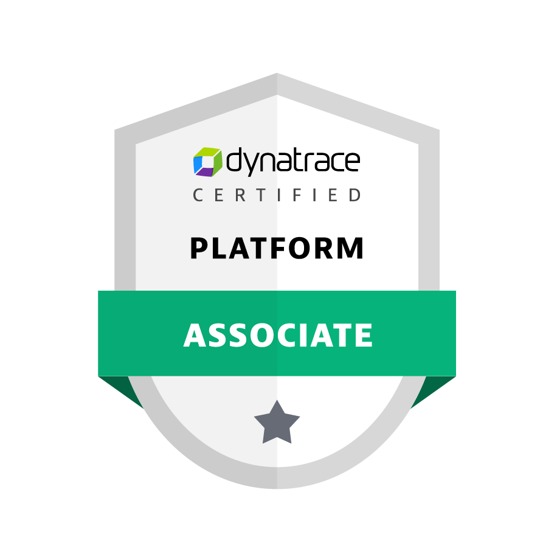

# Dynatrace-Associate-Study-Notes

## About this certification

The Dynatrace Associate Certification validates that you have knowledge of the Dynatrace infrastructure, system capabilities and components, support technologies, reporting, and analysis features and concepts.

## Prerequisites

- Six or more months of hands-on experience with the Dynatrace platform
- Service Oriented Application (SOA) Architectures
- Application Servers, such as WebSphere, WebLogic, JBoss, Tomcat, IIS, etc.
- The structures of mobile and web applications and the underlying hosting architecture, including databases, networks, and processes.
- General knowledge of application performance metrics
Familiarity with Windows, UNIX, VMWare, etc.
- Familiarity with Cloud and New Stack Technologies such as Azure, Docker, Kubernetes, Cloud Foundry, IBM Cloud, OpenStack, OpenShift, etc.

## Exam details

Exam details

- Delivery method - Online proctored exam
- Format - Multiple choice, Multiple response
- Time allowed - 1h 45m
- Skill level - Intermediate
- Language - Multiple languages

## Notes

[Dynatrace Exam Mindmap](https://university.dynatrace.com/assets/21181/dynatrace_associate_mindmap_012023.pdf)

[Dynatrace Microlearning](https://university.dynatrace.com/ondemand)

[Quizlet - Dynatrace Associate Cert](https://quizlet.com/558155195/dynatrace-associate-cert-flash-cards/)

[Quizlet - Dynatrace Associate Certification - Taste of the Test & More](https://quizlet.com/747649005/2022dynatrace-associate-certification-taste-of-the-test-more-flash-cards/)

[Dynatrace Basics - Lab Activities 101](https://dt-transform.com/trainings/dynatrace-basics-activities-101/#27)

[Data Retention Periods](https://www.dynatrace.com/support/help/how-to-use-dynatrace/data-privacy-and-security/data-privacy/data-retention-periods)

